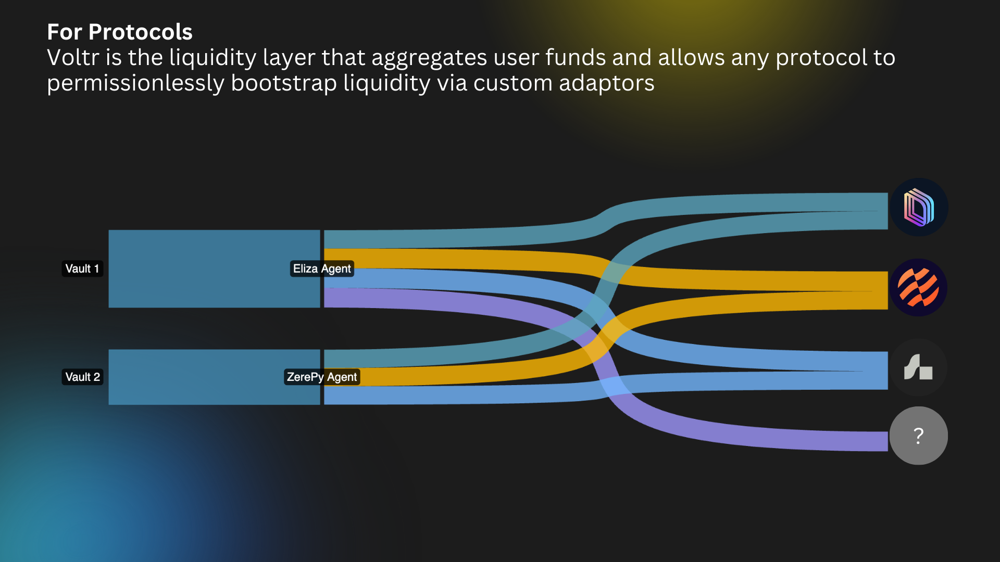

# DeFi Protocol Overview

<figure><figcaption></figcaption></figure>

### Vault (`voltr-vault program`)

Vaults are the primary user interface, managing deposits and handling the accounting of user shares.

### Adaptor (`voltr-adaptor program`)

Adaptors are specialized components, plugged into vaults by vault owners, that handle the actual interaction with DeFi protocols:

* Connect to specific DeFi protocols (e.g. Solend, Drift, Marginfi, Kamino)
* Execute deposits and withdrawals of vault funds into external DeFi protocols
* Track protocol-specific balances
* Handle protocol-specific logic and state management
* Maintain standardized interfaces for vault interaction

### Fundflow

```
Vault <-> Adaptor <-> External Protocol
```
