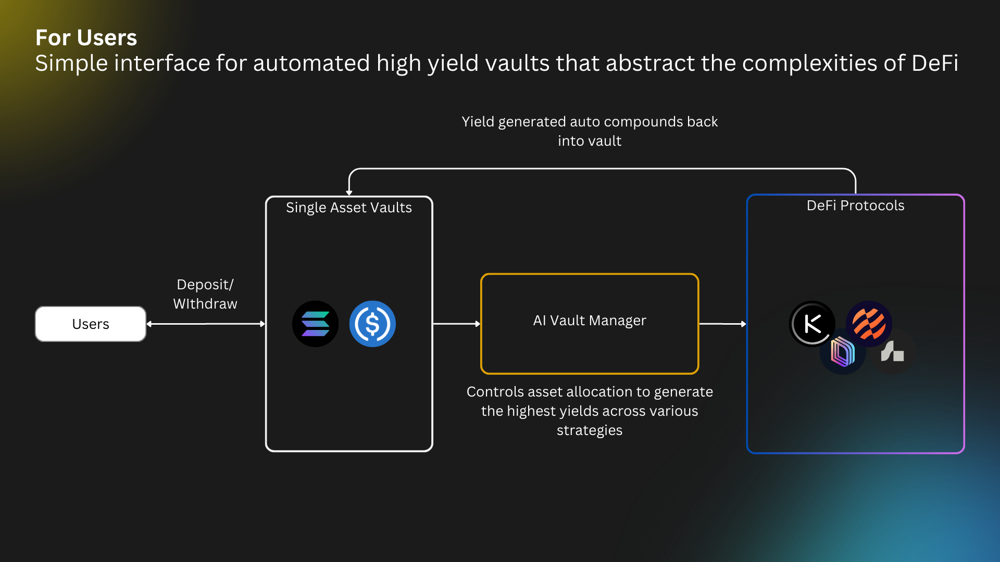

# User Overview

<figure><figcaption></figcaption></figure>

Voltr provides a simple interface for users to access automated high yield vaults. We abstract the complexities of DeFi away from the users, and at the same time ensuring safety and security of users' fund. We provide essential information on every vault — users will be able to track the vaults' performance, allocation strategies, and their personal holdings.
