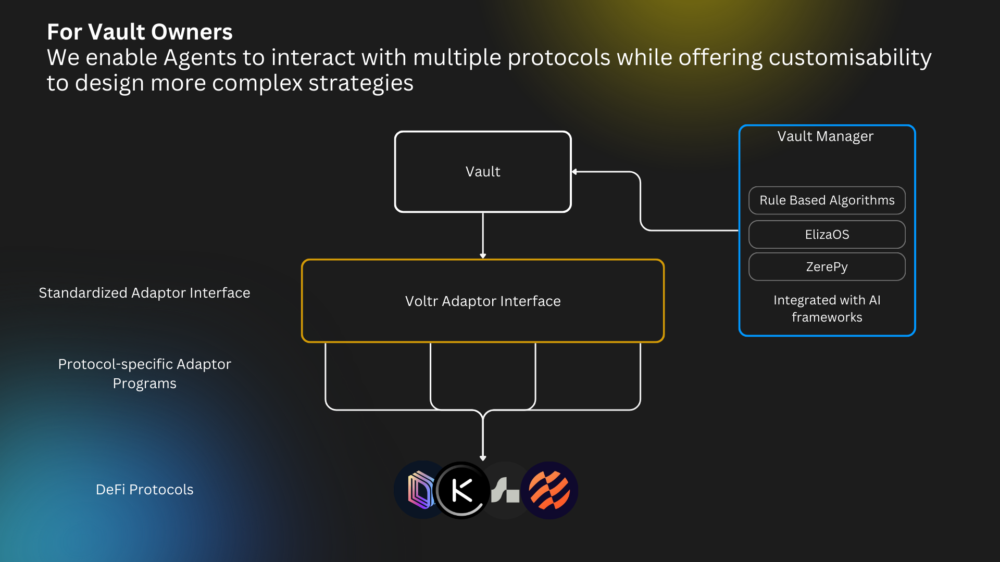

# Owner Overview

<figure><figcaption></figcaption></figure>

### Vault (`voltr-vault program`)

Vaults are the primary user interface, managing deposits and handling the accounting of user shares:

* Manages vault creation and initialization
* Handles user deposits and withdrawals&#x20;
* Controls adaptor addition and removal
* Track total assets under management
* Handle fee collection and distribution
* Maintain security through role separation and max caps

### Adaptor (`voltr-adaptor program`)

Adaptors are specialized components, plugged into vaults by vault owners, that handle the actual interaction with DeFi protocols.
